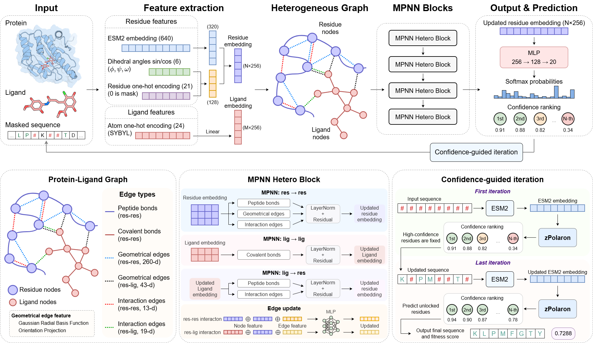
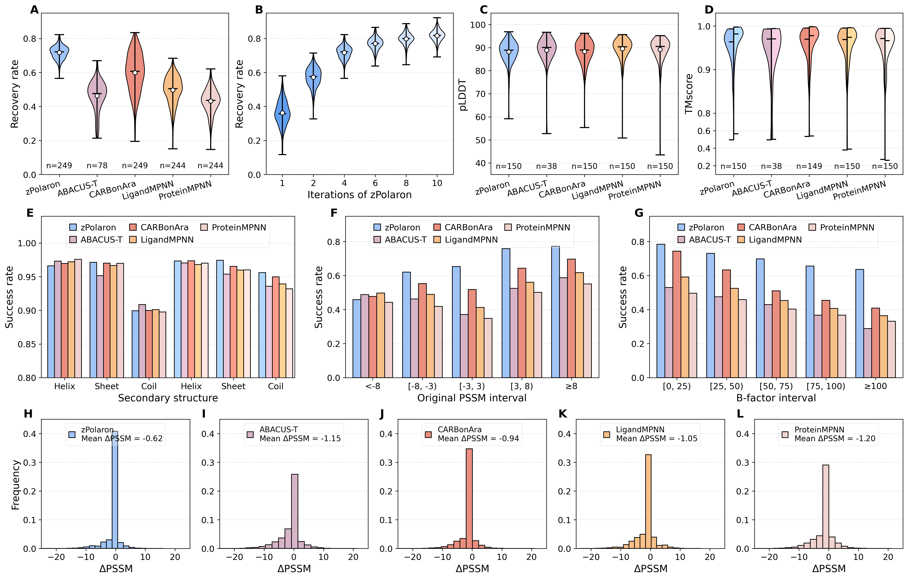
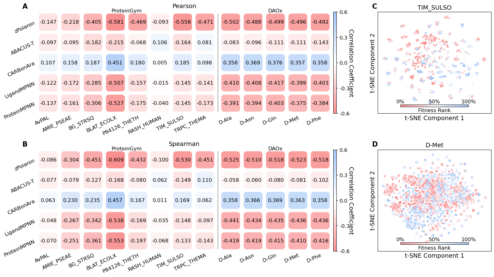
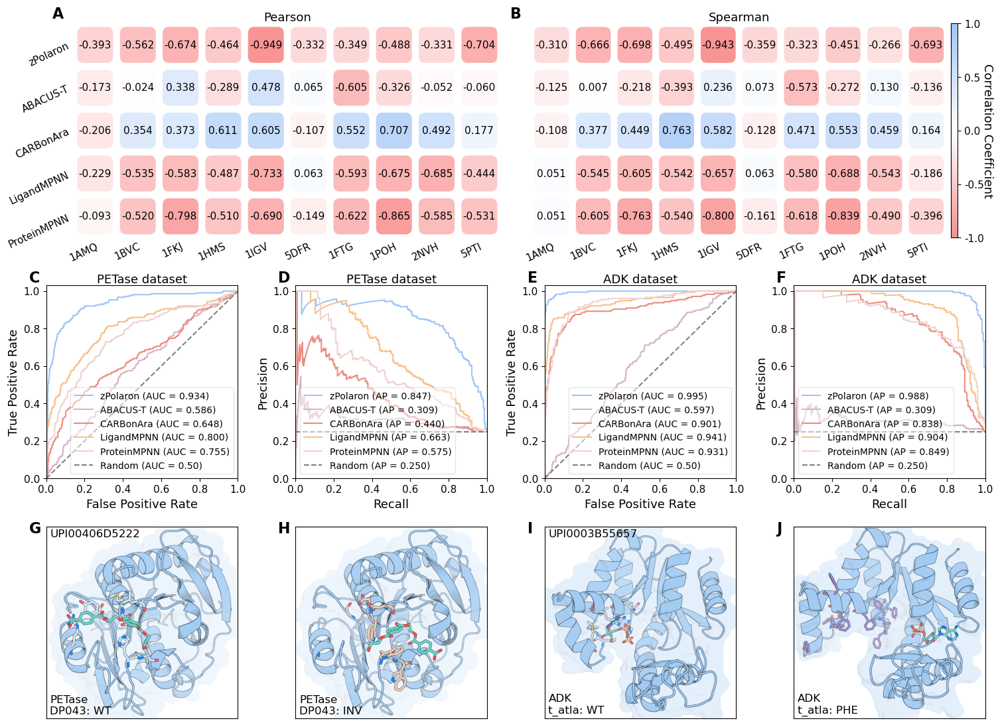

# zPolaron

**Z**elixir's **P**rotein sequence **O**ptimization using **L**ig**A**nd-**R**esidue interacti**O**ns and evolutio**N**

zPolaron (internal early version name: InterEvoMPNN) is a graph neural network-based inverse folding model for protein-ligand complexes. It jointly encodes structural, interaction, and evolutionary information by fusing physical-interaction-enhanced graph representations with ESM-2 embeddings, aiming to move inverse folding from structure-compatible design toward fitness-oriented protein design.

---

## Table of Contents

- [Overview](#overview)
- [Dataset](#dataset)
  - [Training Set (LigandMPNN Complex Dataset)](#training-set-ligandmpnn-complex-dataset)
  - [P450 Enzyme Fine-tuning Dataset](#p450-enzyme-fine-tuning-dataset)
  - [Zero-Shot Scoring Datasets](#zero-shot-scoring-datasets)
- [Model Architecture](#model-architecture)
  - [Graph Construction](#graph-construction)
  - [Node Features](#node-features)
  - [Edge Features](#edge-features)
  - [Heterogeneous Graph Neural Network](#heterogeneous-graph-neural-network)
  - [Confidence-Guided Iterative Design](#confidence-guided-iterative-design)
  - [Message Passing](#message-passing)
- [Training and Loss](#training-and-loss)
- [Inference](#inference)
  - [Masked Recovery](#masked-recovery)
  - [Zero-shot Scoring](#zero-shot-scoring)
  - [Feature Extraction](#feature-extraction)
- [Results](#results)
- [Installation](#installation)
- [Usage](#usage)
  - [Sequence Design](#sequence-design)
  - [Mutant Scoring](#mutant-scoring)
  - [Feature Extraction](#feature-extraction-1)
- [Citation](#citation)
- [Contacts](#contacts)

---

## Overview

Protein design has long been regarded as an inverse inference problem from structure to sequence. Inverse folding provides an important framework for structure-guided protein design: given a protein backbone structure, the objective is to search for an amino acid sequence compatible with this structure. Deep learning-based inverse folding models directly learn the conditional probability distribution between structure and sequence, leading to substantial improvements in recovery performance.

However, most existing inverse folding models employ the sequence recovery rate as their core optimization objective and evaluation metric, focusing essentially on structural compatibility. A high sequence recovery rate does not necessarily indicate successful protein design. In protein-ligand systems, functional activity is determined not only by the protein structure itself but also by whether the protein and ligand establish the correct network of non-covalent interactions. Such constraints may not be fully inferred from protein backbone geometry alone. Moreover, for a given protein structure, many different sequences can maintain the same folded state, whereas the native sequence represents only one outcome preserved under multiple evolutionary selection pressures rather than structural constraints alone.

Based on these observations, zPolaron is founded on the principle that function-oriented protein design is governed by three complementary types of constraints:

1. **Structural constraints** determine whether a protein can fold correctly.
2. **Interaction constraints** determine whether it can accomplish molecular recognition and catalysis.
3. **Evolutionary constraints** reflect functional preferences shaped by long-term natural selection.

To integrate these three sources of information within a unified framework, zPolaron represents protein residues and ligand atoms as different node types in a heterogeneous graph, with six types of edges encoding geometric relationships and physicochemical interactions. Evolutionary representations derived from ESM2 are incorporated as residue node features, and a confidence-guided iterative design strategy is introduced to jointly model structural, interaction, and evolutionary information.


**Figure 1**: Overall framework of the zPolaron model. The model takes a protein-ligand complex structure as input and outputs the probability distribution of 20 amino acids at each masked residue position.

---

## Dataset

### Training Set (LigandMPNN Complex Dataset)

The training dataset originates from the protein-ligand complex dataset released by the **LigandMPNN** study. This dataset contains protein-ligand complexes extracted from high-resolution crystal structures.

- **Training set**: 62,908 samples
- **Validation set**: 3,515 samples (from LigandMPNN's validation split)
- **Test set**: 249 PDB structures published between 2023 and 2025, collected independently. MMseqs2 was used to ensure sequence similarity between test and training data is strictly below 40%.

During data processing, random masking of protein sequences (35% masking ratio) simulates the inverse folding task: given the structure and partial sequence information, the model predicts the original identities of masked residues.

### P450 Enzyme Fine-tuning Dataset

To evaluate adaptability to a specific enzyme family, a dataset was constructed based on cytochrome P450 (CYP) enzymes:

- All enzyme sequences and reaction information were obtained from the **P450Rdb v2.0** database.
- For each enzyme, the protein sequence, heme cofactor (HEM), and corresponding substrate were provided as inputs to **AlphaFold 3** to predict the enzyme-HEM-substrate ternary complex structure. Only samples with successfully generated complex structures were retained.
- Sequences were clustered using **MMseqs2** (easy-linclust) with a 0.4 sequence identity threshold. At most 20 samples were retained per cluster.
- Clusters were randomly divided into **training, validation, and test sets at an approximate ratio of 8:1:1**, with all samples from the same cluster assigned to the same subset.
- During fine-tuning, only the **output classification layer** was updated while the backbone network remained frozen.

### Zero-Shot Scoring Datasets

For zero-shot scoring evaluation, datasets were assembled from multiple sources:

- **Protein stability**: 10 PDB entries from the S2648 dataset (filtered for >10 mutations, single-chain, ligand-containing).
- **Protein fitness**: 8 enzyme targets from ProteinGym with known substrates; plus deep mutational scanning data for DAOx across 5 distinct substrates.
- **Pocket disruption**: ADK dataset (178 adenylate kinase sequences) and PETase dataset (214 PETase variants).

---

## Model Architecture

### Graph Construction

The model uses a **heterogeneous graph neural network** built with PyTorch Geometric, containing the following node and edge types:

| Component | Type | Description |
|-----------|------|-------------|
| **Nodes** | Protein residue nodes | Each amino acid in the structure |
| | Ligand atom nodes | Each atom in the small molecule |
| **Edges** | Residue-residue (peptide bond) | Sequential connectivity along the backbone |
| | Residue-residue (geometric) | Spatial proximity based on Cα-Cα distances |
| | Residue-residue (interaction) | Physicochemical interaction contacts |
| | Residue-ligand (geometric) | Spatial distance between residue Cα and ligand atoms |
| | Residue-ligand (interaction) | Physicochemical interactions between residue and ligand |
| | Ligand-ligand (covalent) | Intramolecular chemical bonds within the ligand |

### Node Features

**Protein residue node features** (667 dimensions, concatenation of three components):

- **ESM2 embeddings** (640-dimensional): The amino acid sequence is encoded using ESM2 (esm2_t30_150M_UR50D). Residues to be redesigned have their amino acid type replaced with a `<mask>` token before embedding to prevent information leakage.
- **Backbone dihedral angles** (6-dimensional): sin/cos encoding of φ, ψ, ω angles.
- **Amino acid identity one-hot** (21-dimensional): The 0th dimension is the mask indicator; dimensions 1-20 encode the actual amino acid one-hot for unmasked residues.

**Ligand atom node features** (24-dimensional): One-hot encoding of SYBYL atom types, classifying atoms into 24 categories (nitrogen, carbon, oxygen, sulfur of different hybridization states, hydrogen, phosphorus, halogen, metal, and other).

### Edge Features

**Residue-residue interaction edges** (13 types):

| Interaction Type | Description |
|-----------------|-------------|
| Hydrophobic (aliphatic-aromatic) | Non-polar side chain contacts |
| Hydrophobic (aliphatic-aliphatic) | Non-polar side chain contacts |
| Hydrophobic (sulfur-aromatic) | Sulfur-aromatic contacts |
| Hydrogen bond (OH...O) | Hydroxyl-oxygen hydrogen bonds |
| Hydrogen bond (NH...O) | Amide-oxygen hydrogen bonds |
| Hydrogen bond (NH...N) | Amide-nitrogen hydrogen bonds |
| π-π stacking (edge-to-face) | Aromatic ring stacking |
| π-π stacking (face-to-face) | Aromatic ring stacking |
| Weak hydrogen bond (CH_aro...O) | Aromatic C-H...O type |
| Weak hydrogen bond (CH_ali...O) | Aliphatic C-H...O type |
| Salt bridge | Electrostatic N⁺...O⁻ interaction |
| Cation-π | Cation-aromatic interaction |
| Disulfide bond | Cysteine-cysteine covalent bond |

**Protein-ligand interaction edges** (19 types):

Includes 5 hydrophobic subtypes, 2 hydrogen bond subtypes, 2 weak hydrogen bond subtypes, 2 π-π stacking subtypes, 2 salt bridge subtypes, 2 amide-π stacking subtypes, 2 cation-π subtypes, 1 halogen bond, and 1 multipolar halogen interaction.

**Geometric edges**:
- **Residue-residue geometric** (260-dimensional): 16 inter-atomic backbone distances × 16 RBF centers (0-20 Å) = 256 dimensions, plus 3 directional projection features and 1 normalized distance scalar.
- **Ligand-residue geometric** (43-dimensional): 5 distances (to C, O, N, CA, virtual CB) × 8 RBF centers (0-8 Å) = 40 dimensions, plus 3 directional projection features.

For **redesigned residues**, all interaction edge features involving that residue are set to zero vectors to prevent information leakage, while the original features are saved as training labels (`edge_y`).

### Heterogeneous Graph Neural Network

1. **Feature projection**: ESM features (640→320) and structural features (27→128) are projected separately, then concatenated and projected to **256-dimensional** hidden representations through linear layers with LayerNorm.

2. **Intra-type message passing (residue nodes)**:
   - **Peptide bond edges**: Standard graph attention convolution (GATConv) aggregates information from sequentially adjacent residues.
   - **Geometric edges and interaction edges**: A custom **AttentiveCrossMessagePassing** module concatenates node features and edge features, then performs multi-head attention weighted aggregation (4 heads).
   - Messages from all three edge types are combined via residual connection and layer normalization.

3. **Intra-type message passing (ligand nodes)**:
   - GATConv aggregates information from chemically bonded ligand atoms.
   - Updated with residual connection and layer normalization.

4. **Cross-type message passing (residue ↔ ligand)**:
   - The **AttentiveCrossMessagePassing** module enables information exchange between residue nodes and ligand nodes via geometric and interaction edges.
   - Interaction edge features are also updated to reflect the new node representations.

5. **Iteration**: The message passing process is repeated **4 times**, after which the model outputs a probability distribution over 20 amino acid types for each masked position.

### Confidence-Guided Iterative Design

zPolaron employs a confidence-guided iterative design strategy — a compromise between traditional auto-regressive generation and single-pass global prediction:

1. All residues to be designed are initially masked.
2. The model outputs predicted probability distributions for all masked positions.
3. Residues are ranked by confidence (max predicted probability), and the top fraction with highest confidence are **locked in**.
4. Locked residue identities replace the original mask tokens and are re-input to ESM2 to obtain updated evolutionary context representations.
5. This process repeats for the specified number of iterations.

This strategy avoids error accumulation (only high-confidence residues are locked each round), progressively enriches context information, and adaptively allocates computational resources. The recommended standard configuration is **4 iterations**.

### Message Passing

The attention cross-message-passing layer first projects edge features to the same dimension as node hidden states, then concatenates them with source and target node features. Multi-head attention (4 heads) assigns importance weights to different neighbors, and outputs are fused through a linear transformation. Edge features are updated jointly with node hidden states at each block.


**Figure 2**: Sequence recovery rate of zPolaron compared with other methods.

---

## Training and Loss

During training, amino acid residues are randomly masked at a **35% masking ratio**. For masked residues, the interaction feature vectors are set to zero (original values saved as labels) and the residue name in the ESM2 input sequence is replaced with `<mask>`.

The total loss combines node classification and edge prediction:

$$L_{\text{total}} = L_{\text{node}} + L_{\text{edge}}^{*}$$

- **Node classification loss** ($L_{\text{node}}$): Cross-entropy with distribution-aware label smoothing, focal loss, entropy regularization, and class-specific weights to address class imbalance and hard-sample learning.
- **Edge prediction loss** ($L_{\text{edge}}^{*}$): Zero-inflated Poisson (ZIP) loss with dynamic weight warmup and sparsity regularization, modeling the zero-inflated count distribution of interaction features.

Key training hyperparameters:

| Hyperparameter | Value |
|---------------|-------|
| Optimizer | AdamW (β1=0.9, β2=0.98, ε=1e-9) |
| Initial learning rate | 0.002 |
| LR schedule | Linear warmup → Cosine annealing |
| Batch size | 12 (gradient accumulation × 2) |
| Dropout | 0.2 |
| Message passing blocks | 4 |
| Hidden dimension | 256 |
| Attention heads | 4 |
| Max epochs | 500 (early stopping, patience=40) |
| GPUs | 4 × NVIDIA A100 (DDP) |

---

## Inference

### Masked Recovery

Two modes are available for sequence recovery:

1. **Specified residue positions**: Only the specified residues are masked. Their ESM2 embeddings and interaction information are removed, and the model predicts the most likely amino acid based on surrounding structural and evolutionary information.

2. **No position specified (full recovery)**: All residue positions use their full information for inference, yielding higher recovery rates.

The **confidence-guided iterative design** strategy (see above) can be used to progressively improve prediction quality over multiple rounds.

### Zero-shot Scoring

For a given protein-ligand complex structure and a sequence to be evaluated, the model outputs the predicted probability distribution of the twenty natural amino acids at each position. The overall sequence score is defined as the mean negative log-likelihood across all positions:

$$\text{Score}(S) = -\frac{1}{L} \sum_{i=1}^{L} \log p_i[s_i]$$

A lower score indicates that the sequence is more compatible with the given structural context and is therefore more likely to be physically plausible. Per-residue confidence can also be computed as `confidence_i = p_i[s_i]`.

### Feature Extraction

The model can extract **128-dimensional feature vectors** from the penultimate hidden layer for downstream visualization and analysis.

---

## Results

zPolaron is evaluated on multiple benchmarks and compared with existing inverse folding methods (ProteinMPNN, LigandMPNN, CARBonAra, ABACUS-T):

- **Sequence recovery**: zPolaron achieves the highest recovery rate on an independent test set (249 PDBs from 2023-2025). AlphaFold 3 reconstruction of designed sequences yields TM-scores above 0.95, confirming structural feasibility.
- **Evolutionary conservation**: zPolaron achieves the best average ΔPSSM (-0.62), and its recovery rate increases monotonically with native PSSM scores, demonstrating consistency with evolutionary conservation.
- **Zero-shot fitness prediction**: On ProteinGym (8 enzyme targets), zPolaron achieves the highest Spearman correlation reaching -0.609. On the DAOx multi-substrate benchmark, correlations remain consistently near -0.5. Ablation studies show that any two of the three information sources suffice to surpass all baselines.
- **Disruptive mutation identification**: AUC of 0.934 (PETase) and 0.995 (ADK) for detecting loss-of-function pocket mutations.
- **P450 generalization**: The pretrained model maintains competitive sequence recovery on AlphaFold 3-predicted CYP structures, further improved by lightweight fine-tuning of the output layer.


**Figure 3**: Zero-shot scoring performance of zPolaron compared with other inverse folding models.


**Figure 4**: Performance on disruptive binding-pocket mutation benchmarks.

---

## Installation

zPolaron requires the following dependencies:

| Package | Purpose |
|---------|---------|
| [ESM2](https://github.com/facebookresearch/esm) | Protein language model embeddings |
| PyTorch | Deep learning framework |
| NumPy | Numerical computing |
| [PyG](https://pyg.org/) (PyTorch Geometric) | Graph neural network library |
| torch-scatter | Scatter operations for PyG |
| [OpenBabel](https://openbabel.org/) | Ligand file format conversion (mol2 support) |
| lmdb | Efficient data storage for training |

```bash
# Example installation (adjust versions based on your CUDA version)
pip install torch
pip install torch-scatter torch-sparse torch-cluster torch-geometric
pip install fair-esm
pip install openbabel
pip install numpy lmdb
```

---

## Usage

### Sequence Design

Please download the model weight files at [https://zenodo.org/records/21308136](https://zenodo.org/records/21308136), and put them into the `scripts` directory. 

The `run_design.py` script redesigns residues in the protein-ligand binding pocket.

**(1) Specify residues to redesign:**

Redesign residues 36 and 109 of chain A, and residue 126 of chain B, considering interactions within 40 Å of the ligand:

```bash
python run_design.py \
    -r protein.pdb \
    -l ligand.mol2 \
    -a A36,A109,B126 \
    -c 40 \
    -o out/design_out.txt
```

**(2) Redesign all pocket residues:**

Use `all_res` to automatically redesign all residues within 40 Å of the ligand:

```bash
python run_design.py \
    -r protein.pdb \
    -l ligand.mol2 \
    -a all_res \
    -c 40 \
    -o out/design_out_all.txt
```

**(3) Iterative refinement:**

Use confidence-guided iterative design with 4 rounds:

```bash
python run_design.py \
    -r protein.pdb \
    -l ligand.mol2 \
    -a A36,A109 \
    -c 40 \
    -n 4 \
    -o out/design_out_iter.txt
```

**Key options:**

| Option | Description |
|--------|-------------|
| `-a` | Residues to redesign (e.g., `A36,A109,B126`) |
| `-c` | Cutoff distance for pocket residues (default: 40 Å) |
| `-n` | Number of iterative refinement rounds (default: 1) |
| `-e` | Use original residue identities in ESM (no masking) |
| `-u` | Use interaction information of redesigned residues |

### Mutant Scoring

The `run_score.py` script computes zero-shot fitness scores for user-defined mutations.

**Example:** Mutate residue 107 of chain A to T, residue 120 of chain A to I, and residue 91 of chain B to Y:

```bash
python run_score.py \
    -r protein.pdb \
    -l ligand.mol2 \
    -c 40 \
    -t A_A107T,A_F120I,B_N91Y \
    -o out/score_out.txt
```

**Key options:**

| Option | Description |
|--------|-------------|
| `-t` | Mutations in format `Chain_OriginResNumMutRes` (e.g., `A_W36T`) |
| `-u` | Use interaction information of original residues when scoring |

### Feature Extraction

The `run_feature.py` script extracts 128-dimensional feature vectors from the model's penultimate layer for downstream tasks.

```bash
python run_feature.py \
    -r protein.pdb \
    -l ligand.mol2 \
    -c 40 \
    -o out/features_128.pt
```

---

## Citation

To be updated.

---

## Contacts

To be updated.

---

## License

To be updated.

## Open Source

The model code is open source and available at [https://github.com/zelixirSH/zPolaron](https://github.com/zelixirSH/zPolaron).

A software copyright has been filed for the underlying method (InterEvoMPNN — Big Data and Large Model-based P450 Element Prediction System).
