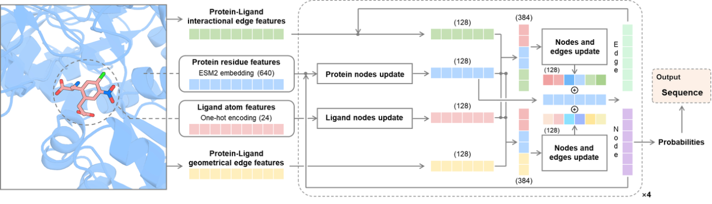
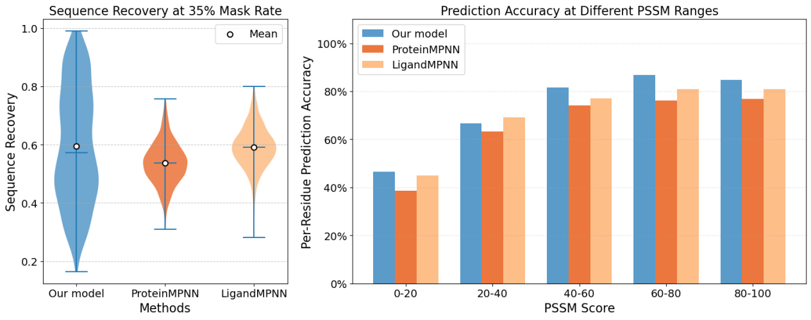
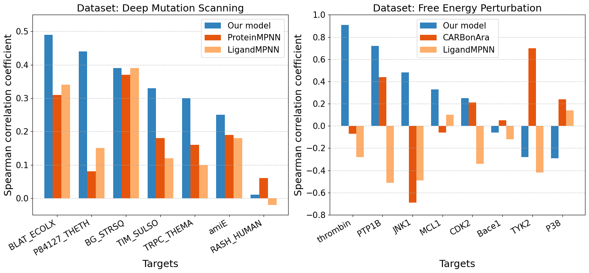

# zPolaron

**Z**elixir's **P**rotein-sequence **O**ptimization using **L**igand-residue interacti**o**ns and evolutio**n**

zPolaron (internal early version name: InterEvoMPNN) is a deep learning-based protein inverse folding model that focuses on the **functional pocket region** — the substrate-binding pocket and its surrounding structure — to directly achieve "function-guided" structure-to-sequence mapping. Unlike traditional global inverse folding approaches that maximize sequence recovery, zPolaron is designed for **high binding affinity and high catalytic activity** by precisely modeling the physicochemical micro-environment of the active site.

---

## Table of Contents

- [Overview](#overview)
- [Dataset](#dataset)
  - [PDBbind Training Set](#pdbind-training-set)
  - [P450 Enzyme Fine-tuning Dataset](#p450-enzyme-fine-tuning-dataset)
- [Model Architecture](#model-architecture)
  - [Graph Construction](#graph-construction)
  - [Node and Edge Features](#node-and-edge-features)
  - [Heterogeneous Graph Neural Network](#heterogeneous-graph-neural-network)
  - [Message Passing](#message-passing)
- [Training](#training)
  - [Masking Strategy](#masking-strategy)
  - [Loss Function](#loss-function)
  - [Training Configuration](#training-configuration)
- [Inference](#inference)
  - [Masked Recovery](#masked-recovery)
  - [Zero-shot Scoring](#zero-shot-scoring)
- [Results](#results)
  - [Sequence Recovery](#sequence-recovery)
  - [Zero-shot Fitness Prediction](#zero-shot-fitness-prediction)
  - [P450 Enzyme Activity Prediction](#p450-enzyme-activity-prediction)
- [Installation](#installation)
- [Usage](#usage)
  - [Sequence Design](#sequence-design)
  - [Mutant Scoring](#mutant-scoring)
- [Citation](#citation)
- [Contacts](#contacts)

---

## Overview

Inverse folding is a core computational task in protein design that aims to predict the amino acid sequence capable of folding into a given target backbone structure — solving the "structure-to-sequence" inverse mapping problem. Inverse folding models can reveal deep sequence-structure-function relationships and perform **zero-shot** prediction of mutation properties, bridging fundamental protein physics with engineering applications.

Existing inverse folding models typically pursue high sequence recovery rates. However, higher recovery does not necessarily correlate with better functional performance. These models often underperform on zero-shot prediction tasks such as catalytic activity optimization, and the designed sequences may lose valuable evolutionary advantages. Moreover, most models rely primarily on backbone information and cannot accurately describe the physicochemical micro-environment of side chains directly involved in catalysis.

zPolaron addresses these limitations by:

1. **Focusing on the functional pocket**: Redesigning the substrate-binding pocket and its surrounding residues rather than the entire protein.
2. **Integrating ligand information**: Explicitly incorporating small molecule ligand atoms as nodes in the graph, enabling the model to learn protein-ligand interaction patterns.
3. **Incorporating evolutionary information**: Using ESM2 large language model embeddings as residue features to capture evolutionary conservation.
4. **Modeling diverse interactions**: Encoding specific interaction types (hydrophobic contacts, hydrogen bonds, π-π stacking, salt bridges, etc.) as edge features.


**Figure 1**: Overall framework of the zPolaron model based on deep learning graph neural networks. The model takes a protein-ligand complex structure as input and outputs the probability distribution of 20 amino acids at each masked residue position.

---

## Dataset

### PDBbind Training Set

The primary dataset is derived from **PDBbind v.2020**, a comprehensive resource of protein-small molecule complex structures extracted from the Protein Data Bank (PDB), with experimentally measured binding affinity data (Kd, Ki, IC50 values) and curated annotations.

**Data processing pipeline:**

1. Complex structures from PDBbind 2020 are filtered and processed.
2. **MMseq2** with a **30% sequence identity threshold** is used to de-duplicate the complexes against the LigandMPNN small molecule test set.
3. The final filtered set contains **16,230** protein-small molecule complexes with good sequence-level independence.
4. These are split into **training set** (14,607 complexes, 90%) and **validation set** (1,623 complexes, 10%).

### P450 Enzyme Fine-tuning Dataset

For P450-specific fine-tuning, the [P450 Reaction Database](https://www.cellknowledge.com.cn/p450rdb/) is used, containing:

- ~1,600 enzymatic reactions
- ~600 P450 proteins
- ~200 species

To avoid data bias from proteins catalyzing multiple reactions, a maximum of **5 reactions per protein sequence** is retained. The data is split 9:1 into training and validation sets, ensuring no identical protein sequences exist across the two sets.

---

## Model Architecture

### Graph Construction

The model uses a **heterogeneous graph neural network** built with PyTorch Geometric, containing the following node and edge types:

| Component | Type | Description |
|-----------|------|-------------|
| **Nodes** | Protein residue nodes | Each amino acid in the structure |
| | Ligand atom nodes | Each atom in the small molecule |
| **Edges** | Residue-residue (peptide bond) | Sequential connectivity along the backbone |
| | Residue-residue (geometric) | Spatial proximity based on Cα-Cα distances |
| | Residue-residue (interaction) | Physicochemical interaction contacts |
| | Residue-ligand (geometric) | Spatial distance between residue Cα and ligand atoms |
| | Residue-ligand (interaction) | Physicochemical interactions between residue and ligand |
| | Ligand-ligand (covalent) | Intramolecular chemical bonds within the ligand |

### Node and Edge Features

**Protein residue node features:**

- **ESM2 embeddings** (640-dimensional): The amino acid sequence is encoded using the ESM2 language model. Residues to be redesigned have their amino acid type replaced with a `<mask>` token before embedding to prevent information leakage.

**Ligand atom node features:**

- **One-hot encoding** of atom types.

**Edge features for residue-residue interactions:**

The following interaction types are calculated between residue pairs (including side chain atoms) and between residues and ligand atoms:

| Interaction Type | Description |
|-----------------|-------------|
| Hydrophobic contact | Non-polar side chain contacts |
| Hydrogen bond | Standard hydrogen bonding |
| Weak hydrogen bond | C-H...O/N type hydrogen bonds |
| π-π stacking | Aromatic ring stacking |
| Salt bridge | Electrostatic interaction between charged groups |
| Amide-π stacking | Amide-aromatic interaction |
| Cation-π interaction | Cation-aromatic interaction |
| Halogen bond | Halogen-oxygen/nitrogen interaction |
| Disulfide bond | Cysteine-cysteine covalent bond |
| Halogen multipolar | Halogen interactions with multiple polar groups |

For **redesigned residues**, all interaction edge features involving that residue are set to zero vectors to prevent information leakage, ensuring the prediction is based only on messages from neighboring residues and ligand atoms.

### Heterogeneous Graph Neural Network

1. **Feature projection**: Node features and edge features are projected to **128-dimensional** vectors through linear layers and LayerNorm normalization.

2. **Intra-type message passing (residue nodes)**:
   - **Peptide bond edges**: Standard graph attention convolution (GATConv) aggregates information from sequentially adjacent residues.
   - **Geometric edges and interaction edges**: A custom **AttentiveCrossMessagePassing** module concatenates node features and edge features, then performs weighted aggregation.
   - Messages from all three edge types are combined via residual connection and layer normalization.

3. **Intra-type message passing (ligand nodes)**:
   - GATConv aggregates information from chemically bonded ligand atoms.
   - Updated with residual connection and layer normalization.

4. **Cross-type message passing (residue ↔ ligand)**:
   - The **AttentiveCrossMessagePassing** module enables information exchange between residue nodes and ligand nodes via:
     - Residue-ligand geometric edges
     - Residue-ligand interaction edges
   - Interaction edge features are also updated to reflect the new node representations.

5. **Iteration**: The message passing process is repeated **4 times**, after which the model outputs a probability distribution over 20 amino acid types for each masked position.


**Figure 2**: Sequence recovery rate of zPolaron compared with other methods. zPolaron achieves comparable mean recovery to LigandMPNN but with a wider distribution, which correlates with residue evolutionary conservation.

---

## Training

### Masking Strategy

During training, amino acid residues are randomly masked. For masked residues:
- The interaction feature vectors are set to zero.
- The residue name in the sequence is replaced with `<mask>`.

The **masking ratio is set to 35%** as a balance between:
- Providing sufficient known information for meaningful ESM2 embeddings
- Challenging the model to learn genuine structure-to-sequence relationships

**Comparison of masking strategies:**

| Training Mask | Test: Pocket 12Å | Test: Pocket 15Å | Test: Pocket 20Å | Test: Random 20% | Test: Random 35% | Test: Random 50% |
|:---:|:---:|:---:|:---:|:---:|:---:|:---:|
| Pocket 12Å | **0.7141** | 0.4956 | 0.2290 | 0.3938 | 0.3899 | 0.3731 |
| Pocket 15Å | 0.6667 | **0.6980** | 0.3203 | 0.4055 | 0.4033 | 0.3913 |
| Pocket 20Å | 0.5684 | 0.5411 | **0.6453** | 0.4169 | 0.4171 | 0.4114 |
| Random 30% | 0.5987 | 0.4960 | 0.3113 | 0.6052 | 0.5993 | 0.5735 |
| Random 35% | 0.6171 | 0.5237 | 0.3368 | 0.6095 | **0.6067** | 0.5839 |
| Random 50% | 0.6422 | 0.5829 | 0.4293 | 0.5915 | 0.5886 | 0.5817 |

The **random 35% masking** model is selected as the final configuration, providing the best balance between known and unknown information.

### Loss Function

The total loss combines two components:

$$L_{\text{total}} = L_{\text{node}} + \beta L_{\text{edge}}$$

- **$L_{\text{node}}$**: Cross-entropy loss for amino acid residue type prediction at masked positions.
- **$L_{\text{edge}}$**: Zero-inflated Poisson loss for predicting the interaction edge features of masked residues.
- **$\beta$**: Weighting hyperparameter, set to **1.0**.

### Training Configuration

| Hyperparameter | Value |
|---------------|-------|
| Initial learning rate | 0.001 |
| Learning rate schedule | Linear warmup (1% → 100% of initial) → Cosine annealing |
| Batch size | 30 |
| Early stopping | Based on validation loss |
| Optimizer | Adam |

---

## Inference

### Masked Recovery

Two modes are available for sequence recovery:

1. **Specified residue positions**: Only the specified residues are masked. Their ESM2 embeddings and interaction information are removed, and the model predicts the most likely amino acid based on surrounding structural and evolutionary information.

2. **No position specified (full recovery)**: All residue positions use their full information for inference. This yields higher recovery rates. Positions that cannot be correctly recovered may indicate residues that are evolutionarily non-conserved or structurally unstable.

### Zero-shot Scoring

The model's predicted probabilities for each amino acid at each position can be used to compute a **fitness score** for any given sequence-structure combination:

$$\text{Fitness} = \sum_i \log P(aa_i | \text{structure, ligand})$$

This score correlates with:
- **Enzyme activity** (measured by deep mutational scanning)
- **Binding free energy** (measured by free energy perturbation / FEP)

---

## Results

### Sequence Recovery

zPolaron achieves comparable average recovery to LigandMPNN on the LigandMPNN small molecule test set, while exhibiting a wider distribution range. Analysis of recovery rates stratified by PSSM (Position-Specific Scoring Matrix) probability reveals a clear correlation: **higher evolutionary conservation leads to higher recovery rates** across all methods (ProteinMPNN, LigandMPNN, and zPolaron).

### Zero-shot Fitness Prediction


**Figure 3**: Correlation between zero-shot scores and protein (primarily enzyme) mutational fitness. Results show zPolaron outperforms ProteinMPNN and LigandMPNN on 6 out of 7 targets in deep mutational scanning datasets.

**Key findings:**
- Across **7 deep mutational scanning targets**, zPolaron outperforms ProteinMPNN and LigandMPNN on **6 targets** in terms of zero-shot prediction correlation.
- In **free energy perturbation (FEP)** datasets, LigandMPNN showed contradictory correlations on most targets. While CARBonA achieved >0.4 correlation on two systems, its correlation on most targets was unsatisfactory.
- zPolaron maintains **positive correlation on 5 out of 7 FEP targets**, with **>0.7 correlation on 2 targets**, demonstrating stronger zero-shot scoring capability reflecting sequence-structure-function relationships.

### P450 Enzyme Activity Prediction

P450 enzymes are nature's most versatile biocatalysts, catalyzing over 95% of reported oxidation and reduction reactions. Zero-shot scoring was evaluated on **8 P450 enzyme-substrate systems**:

| Target | Substrate | Zero-shot Pearson | Zero-shot Spearman | Fine-tuned Pearson | Fine-tuned Spearman |
|:---|:---|---:|---:|---:|---:|
| CYP2A6 | C1=CC=C2C(=C1)C=CC(=O)O2 | 0.09 | 0.08 | **0.25** | **0.29** |
| CYP1A2 | CN1C2=C(C3=C(C=C2)N=CC=C3)N=C1N | -0.26 | -0.33 | **-0.27** | **-0.26** |
| CYP1A2 | CC1=CC2=C(C3=C1N=CC=C3)N=C(N2C)N | -0.44 | -0.64 | **-0.47** | **-0.56** |
| CYP1A2 | CN1C2=C(N=CC(=C2)C3=CC=CC=C3)N=C1N | -0.47 | -0.46 | -0.47 | **-0.36** |
| CYP1A2 | CC1=CN=C2C=CC3=C(C2=N1)N=C(N3C)N | -0.06 | 0.16 | -0.05 | 0.16 |
| CYP1A2 | CC1=CC=CN2C1=NC3=C2N=C(C=C3)N | 0.06 | 0.26 | **0.11** | **0.33** |
| CYP105A1 | CC(C)CCCC(C)C1CCC2C1(CCCC2=CC=C3CC(CC(C3=C)O)O)C | **0.86** | **0.70** | 0.84 | **0.82** |
| CYP105A1 | CC(CCCC(C)(C)O)C1CCC2C1(CCCC2=CC=C3CC(CCC3=C)O)C | **0.72** | **0.64** | 0.71 | **0.78** |

**After fine-tuning on P450 data** (freezing most parameters and fine-tuning only the prediction head):
- Negative correlations became weaker
- Positive correlations became stronger
- Overall improvement across all P450 targets

This demonstrates that continued model refinement with P450-specific data can enhance prediction capability for P450 enzyme-substrate systems.

---

## Installation

zPolaron requires the following dependencies:

| Package | Purpose |
|---------|---------|
| [ESM2](https://github.com/facebookresearch/esm) | Protein language model embeddings |
| PyTorch | Deep learning framework |
| NumPy | Numerical computing |
| [PyG](https://pyg.org/) (PyTorch Geometric) | Graph neural network library |
| torch-scatter | Scatter operations for PyG |
| [OpenBabel](https://openbabel.org/) | Ligand file format conversion (mol2 support) |

```bash
# Example installation (adjust versions based on your CUDA version)
pip install torch
pip install torch-scatter torch-sparse torch-cluster torch-geometric
pip install fair-esm
pip install openbabel
pip install numpy
```

---

## Usage

### Sequence Design

The `run_design.py` script redesigns residues in the protein-ligand binding pocket.

**(1) Specify residues to redesign:**

Redesign residues 36 and 109 of chain A, and residue 126 of chain B, considering interactions within 40 Å of the ligand:

```bash
python run_design.py \
    -r protein.pdb \
    -l ligand.mol2 \
    -a A36,A109,B126 \
    -c 40 \
    -o out/design_out.txt
```

**(2) Redesign all pocket residues:**

Without specifying positions, redesign all residues within 40 Å of the ligand:

```bash
python run_design.py \
    -r protein.pdb \
    -l ligand.mol2 \
    -c 40 \
    -o out/design_out_all.txt
```

### Mutant Scoring

The `run_score.py` script computes zero-shot fitness scores for user-defined mutations.

**Example:** Mutate residue 107 of chain A to T, residue 120 of chain A to I, and residue 91 of chain B to Y:

```bash
python run_score.py \
    -r protein.pdb \
    -l ligand.mol2 \
    -c 40 \
    -t A_A107T,A_F120I,B_N91Y \
    -o out/score_out.txt
```

---

## Citation

To be updated.

---

## Contacts

To be updated.

---

## License

To be updated.

## Open Source

The model code is open source and available at [https://github.com/zelixirSH/zPolaron](https://github.com/zelixirSH/zPolaron).

A software copyright has been filed for the underlying method (InterEvoMPNN — Big Data and Large Model-based P450 Element Prediction System).
